I build machine-learning systems end to end — the model, the backend around it, and the infrastructure it runs on — and I spend the rest of my time on offensive security. I lead **[Cortex Crew](https://cortexcrew.vercel.app)**, a six-person competition team at Daffodil International University: five results in 2026, including a championship.

### Selected work

|  |  |
| --- | --- |
| **[Autopilot](https://github.com/kawsher-hridoy/Autopilot)** | Predicts GPU failure ~100 seconds ahead and migrates the running job automatically — DCGM telemetry → LightGBM countdown → real Kubernetes cordon/evict/reschedule. |
| **[DIU-AI-Mentor](https://github.com/kawsher-hridoy/DIU-AI-Mentor)** | University mentoring copilot: a deterministic 8-signal risk engine ranks every mentee, an LLM writes the briefings. FastAPI + Next.js. |
| **Darktrace3** | Breach-exposure platform that works from infostealer logs — it can tell a person they were compromised by a stealer and which of their accounts were exposed, not just that their address appeared in *some* leak. Flask + SQLite. *Source private.* |
| **Niro** | Patient-owned medical records with AI document analysis in Bangla. Two competition results in one year. *Source private.* |

### Stack

`Python` `TypeScript` `FastAPI` `Next.js` `LightGBM / scikit-learn` `Docker · Kubernetes` `Linux` `SQLite · Prisma`

<picture>
  <source media="(prefers-color-scheme: dark)" srcset="https://raw.githubusercontent.com/kawsher-hridoy/kawsher-hridoy/output/github-snake-dark.svg">
  
</picture>

### Find me

[LinkedIn](https://linkedin.com/in/kawsher-hridoy) · [kawsher@hridoy.xyz](mailto:kawsher@hridoy.xyz) · [cortexcrew.vercel.app](https://cortexcrew.vercel.app) · [Facebook](https://www.facebook.com/KawsherHRidooy/) · [Instagram](https://www.instagram.com/kawsherhridoy/) · [Telegram](https://t.me/hridooy)
